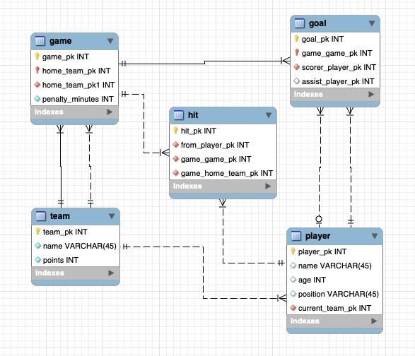
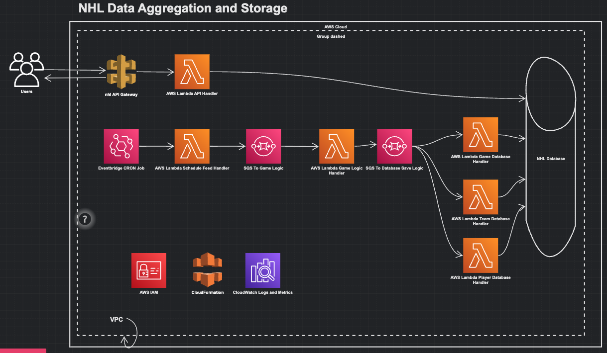

<!--
title: 'NHL Data Pipeline'
description: 'This project is an ingestion pipeline of data from the NHL. This utilizes the serverless framework
and AWS to parse game data into stored, accessible data. The AWS services that are used are CloudFormation, 
Lambda, SQS, RDS, and EventBridge.'
layout: Doc
framework: v3
platform: AWS
language: nodeJS
priority: 1
authorLink: 'https://github.com/Eli017'
authorName: 'Eli Sokeland'
authorAvatar: 'https://github.com/account'
-->


# NHL Data Pipeline

This project is an ingestion pipeline of data from the NHL. This utilizes the serverless framework
and AWS to parse game data into stored, accessible data. The AWS services that are used are CloudFormation, 
Lambda, SQS, RDS, and EventBridge.

## Installation

### Dependencies

- Ensure that you have the latest NodeJS installed (version 18.16.0 as of publishing).
  - Here is the download link for NodeJS: https://nodejs.org/en/download.
- In order to deploy to AWS, please make sure you are signed into the AWS v2 CLI.
  - Here is a link to get started: https://docs.aws.amazon.com/cli/latest/userguide/getting-started-install.html.
- This project was built with the Yarn package manager, please ensure that this is installed.
  - Here is the installation link for Yarn: https://yarnpkg.com/getting-started/install.

Before usage, ensure that you have run `yarn` to install all dependencies before usage.

### Code Changes

While it is ideal to hide away environment secrets using a `.env` file, this project currently has some variables
out in the open due to compilation and clarity. In order to use this effectly, please change the following items
in the `serverless.yml` file:

1. `securityGroupIds` and `subnetIds` need to be changed to your personal default VPC to secure the solution entirely.
2. The API Gateway and Execute API ID and ARNs (respectively) need replaced under the `Resource` tag in the `iam` section.
    1. Feel free to change the iam permissions of the actions as well, it's best to only give the required permissions.
3. Under the `NHL` RDS instance, please replace the `MasterUsername` and the `MasterUserPassword`.
4. Lastly, under the `databaseGame` and `nhlAPI` lambdas, please replace the database credentials that correspond with the `NHL` configuration mentioned above.

### Database

Serverless doesn't support table definitions out of the box. Luckily, there is script included
in this project that contains the necessary SQL to generate the tables and connections. To
execute this statement, please do the following.

1. Ensure that MySQL and MySQL Workbench are set up on your local machine.
2. Run through the deployment steps listed below to instantiate the RDS database.
3. Add the 'MySQL/Aurora' security group for your IP address to allow remote connections.
4. Connect to the RDS instance using the MySQL Workbench.
5. Under the 'Database' tab, click on 'Forward Engineer.'
6. Using the file included in this project, execute this script into the remotely connected database.

If everything went correctly, there should be a schema on the left Workbench panel with the newly added tables.

## Usage

### Deployment

In order to deploy the project, you need to run the following command:

```
$ yarn deploy
```

After running deploy, you should see output similar to:

```bash
Deploying nhl-data-pipeline to stage dev (us-east-1)

✔ Service deployed to stack nhl-data-pipeline-dev (112s)

functions:
  hello: nhl-data-pipeline-dev-hello (1.5 kB)
```

### Invocation

After successful deployment, you can invoke the deployed function by using the following command:

```bash
serverless invoke --function handleScheduleFeed
```

Which should result in response similar to the following:

```json
{
    "statusCode": 200,
    "body": "{\"message\":\"SQS Message sent!\"}"
}
```

### Local development

You can invoke your function locally by using the following command:

```bash
serverless invoke local --function hello
```

The response will be different, due to the project's dependency on AWS services:

```
Could not resolve "QUEUE_URL" environment variable: Unsupported environment variable format: {
  'Fn::Sub': 'https://sqs.${AWS::Region}.amazonaws.com/${AWS::AccountId}/schedule-to-game-logic-queue'
}
```

### Resources

#### Database

Here is the following database structure that this program is based off of.
Please note that this does not have all of the data that the URL sources contain.
This is meant to be a barebones application that filters out the information into its essentials.



#### AWS Architecture

Here is the following AWS architecture that this solution is based off of.
Please note that this is only an abstract, as specific details such as VPC configurations,
Cloudformation settings, and iAM role permissions are not specified.




### Future Work

While this application does complete the tasks mentioned by the challenge (aggregation and storage
of NHL data per game), this lacks some security features and architecture improvements.

1. First, the use of hard-coded values should never be shown in public, so there should be a focus on adding environment
variables.
2. The iAM user specified by the `serverless.yml` file has too many permissions, this should be slimmed down.
3. There should be a Redis Cache, as this would improve unnecessary networking calls.
4. The database should have hits focused on the team, not the player.
5. The SQL statements do work, but I think there could be improvement in how the initial insert could be handled.
    1. This could be solved by breaking down the lambdas even more.
    2. The lambdas should be more sequential, as storing games requires team IDs to look for. If the team lambda isn't
       finished/the team isn't in the database, this could lead to a failure.
6. The parsing of information from the NHL API is vast and requires multiple calls. Knowing when to make these calls
   and how to slim them down into usable information for the API would be better.
7. Lastly, the API created uses REST and CRUD operations. While this is fine, GraphQL and AppSync could've been a better
   option. I am unsure if AppSync requires a DynamoDB storage instead of an RDS database though.
